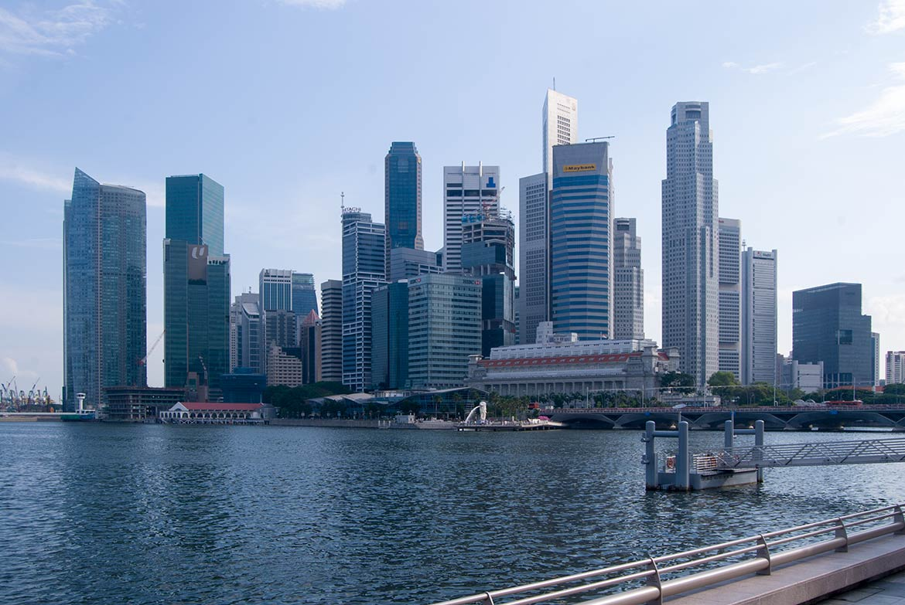
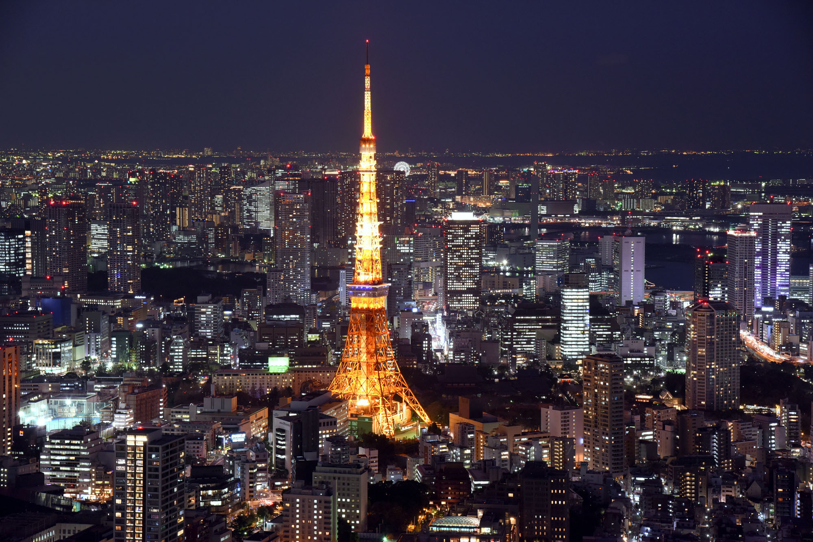

# Tokyo, New York, Singapore:  Major Cities
## In-class exercise 5: Information Architecture and Markdown 
### Jovan-Gianni Lee 
### Feburary 5th 2018

#### Intro
 Paris, New York, and Toronto are all major cities and contain over 67 million people combined as well as an economy larger than many small countries! Furthermore each city is a innavators of public transportation systems with New York's Metro Transit Authority operating 24 hours and servicing about 6 million people per day, Japan Ralways Group also servicing around 6 million and Singapore servicing **only 3 million people per day** a much smaller number! Each country has a very rich tradition and culture as well. New York was originally called New Amsterdam, Sinapore was originally called *Singa Pura*, which meant *Lion City* in Sanskrit, and Tokyo was originally known as Edo. 
 
 The main differences in the country is firstly the location of each. Each country is located in different locations of the world Tokyo is located in North East Asia, Singapore South East Asia, and New York within North America

| City          | Location      | Population  |
| ------------- |:-------------:| -----------:|
| New York      | North America | 8.5 million |
| Tokyo         | NE Asia       | 9.2 million |
| Singapore     | SE Asia       | 5.6 million |

New York City

Singapore

Tokyo

#### Infrastrucutre
The economies of these propspective countries are also very large.  In 2012, the New York City Metropolitan Statistical Area generated a gross metropolitan product (GMP) of over US$1.33 trillion, while the Combined Statistical Area produced a GMP of over US$1.55 trillion, both ranking first nationally by a wide margin and being roughly equivalent to the GDP of South Korea.  

Tokyos area has the largest metropolitan economy in the world, with a total GDP (nominal) of approximately $2 trillion (¥165 trillion) in 2008. According to research published by PricewaterhouseCoopers, the agglomeration of Tokyo had a total GDP of $1.5 trillion in 2008 (at purchasing power parity), ranking again as the largest urban agglomeration GDP in the world.

The economy of Singapore is a highly developed free-market economy. Singapore's economy has been ranked as the most open in the world,  7th least corrupt, most pro-business,[20] with low tax rates (14.2% of Gross Domestic Product, GDP) and has the third highest per-capita GDP in the world in terms of Purchasing Power Parity (PPP). APEC is headquartered in Singapore.

#### I love Cities!
I do too which is why I decided to give you a link where you can learn more about major metropolitan cities here. Feel free to  [browse](https://www.google.com) to your hearts content 

